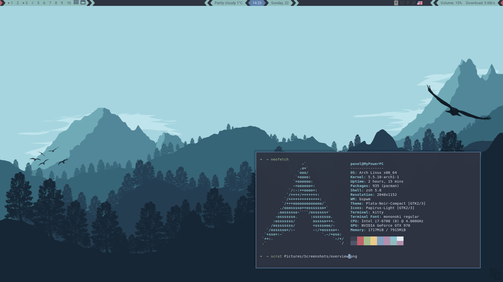
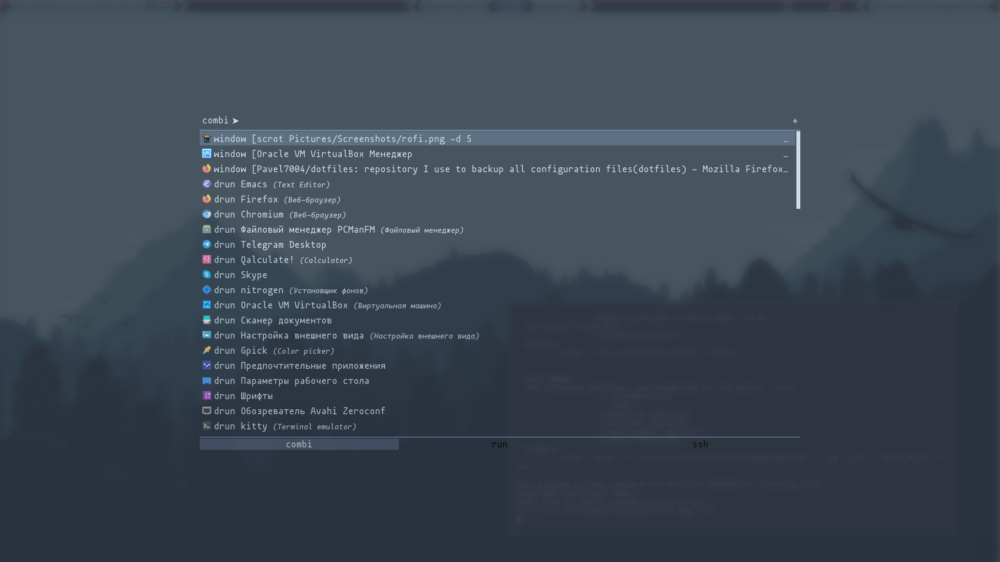
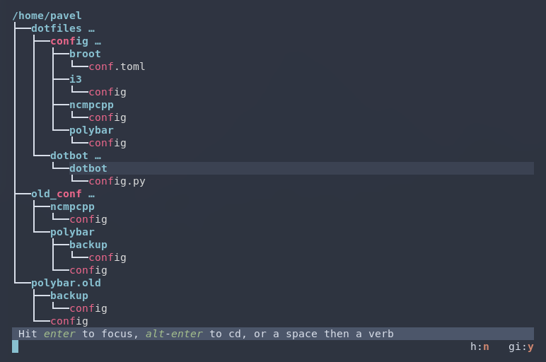

Dotfiles
=================

| Program              | Name                |
|----------------------|---------------------|
| Window manager       | `bspwm`             |
| Window Compositor    | `picom`             |
| Notification daemon  | `dunst`             |
| Terminal             | `kitty`             |
| Shell                | `zsh`,`oh-my-zsh`   |
| Application launcher | `rofi`              |
| Music player         | `mpd`, `ncmpcpp`    |
| Editor               | `nvim`,`doom emacs` |
| File manager         | `vifm`              |

Screenshots
-----------------
Overview:

Rofi:

[Broot][broot]:

[broot]: https://github.com/Canop/broot
